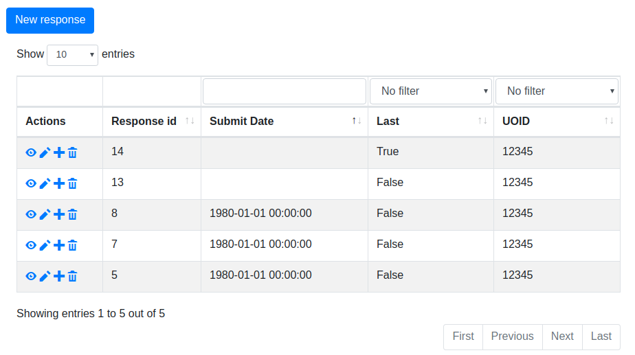
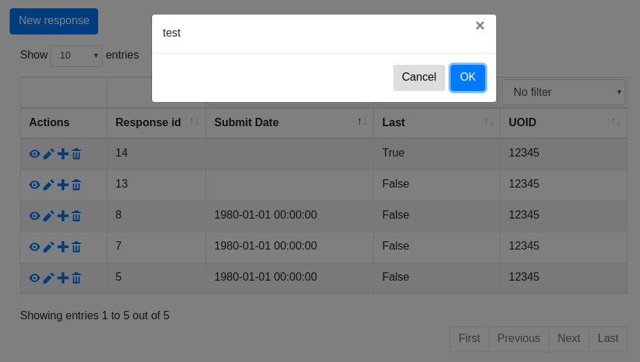

# LimeSurvey Response Picker Plugin
Adds advanced support for managed multiple responses where the respondent
does the management.

# Screenshots
Uses bootstrap 4 layout and bootbox popups.

Columns in the overview are configurable

Confirmation text for each action is configurable

# Security

This plugin operates under the assumption that anyone with the token
is allowed to manage responses. Since the token is random there is no
extra protection against CSRF.
Since there is no authentication other than the unique link, such
protection is not of any added value.